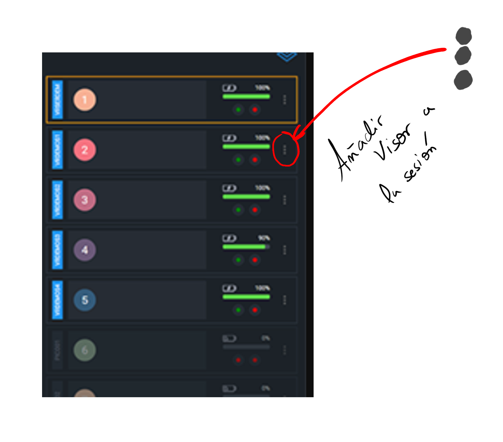
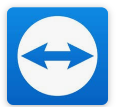

# 🇪🇸 🥽 Guía Básica de Uso de la Sala de Realidad Virtual VIROO (Texto Plano)

  - [🇪🇸 Guía Básica de Uso de la Sala de Realidad Virtual VIROO (Texto Plano)](https://www.google.com/search?q=%23-gu%C3%ADa-b%C3%A1sica-de-uso-de-la-sala-de-realidad-virtual-viroo-texto-plano)
      - [1. 🗓️ Preparación Previa y Reserva (Paso Obligatorio)](https://www.google.com/search?q=%231-preparaci%C3%B3n-previa-y-reserva-paso-obligatorio)
      - [2. 🏗️ Acondicionamiento del Espacio](https://www.google.com/search?q=%232-acondicionamiento-del-espacio)
      - [3. 🔌 Puesta en Marcha de los Equipos (VIROO)](https://www.google.com/search?q=%233-puesta-en-marcha-de-los-equipos-viroo)
      - [4. ▶️ Inicio de la Sesión VIROO](https://www.google.com/search?q=%234-inicio-de-la-sesi%C3%B3n-viroo)
      - [🏁 Finalización (Cierre)](https://www.google.com/search?q=%23finalizaci%C3%B3n-cierre)
      - [⚠️ Problemas Conocidos](https://www.google.com/search?q=%23problemas-conocidos)

-----

## 1\. 🗓️ Preparación Previa y Reserva (Paso Obligatorio)

  - **✅ Confirmar Disponibilidad:**
⚠️ Es OBLIGATORIO comprobar la disponibilidad en el horario antes de planificar la sesión.
🔗 Consulta el horario a través de este enlace: [enlace al horario de la sala]
ℹ️ Si necesitas asistencia, los viernes, Mikel Dalmau está disponible de 8:30 a 9:30 o a partir de las 10:30 (con previo aviso).

-----

## 2\. 🏗️ Acondicionamiento del Espacio

  - **Paso 1: 🧹 Despejar la Zona de Juego:**
Desplaza todas las mesas y sillas hacia los lados del aula para dejar el mayor espacio posible. [Foto de la sala con mesas desplazadas]

  - **Paso 2: 💡 Ajustar Iluminación:**
🕶️ Asegúrate de que las persianas estén completamente cerradas.
🔆 Verifica que la luz de la sala esté encendida.

## 3\. 🔌 Puesta en Marcha de los Equipos (VIROO)

  - **Paso 3: 🔓 Abrir el Rack de Equipos:**
Ireki el rack deslizando la manilla. No es necesario utilizar ninguna llave. [Foto del rack]

  - **Paso 4: 💻 Encender Equipos de Visores (PCs):**
    🔢 Los equipos y visores están numerados del 1 al 5.
⚡ Enciende SOLO la cantidad de equipos que correspondan a los visores que vayas a utilizar. [Foto de los equipos]

  - **Paso 5: 🖥️ Encender y Acceder al Servidor:**
Piztu el Equipo Servidor.
🔑 Accede al sistema operativo utilizando las credenciales proporcionadas.

  - **Paso 7: 🥽 Abrir y Encender los Visores VR:**
🔑 Abre el armario de los visores. La llave se encuentra dentro del rack. [Foto del armario y la ubicación de la llave]
🔘 Enciende cada visor manteniendo pulsado el botón de encendido. [Foto del botón de encendido del visor]

## 4\. ▶️ Inicio de la Sesión VIROO

  - **Paso 8: 🖱️ Abrir el Programa VIROO Room Player:**
En el servidor, haz doble clic en el icono del programa VIROO Room Player. [Foto del icono del programa]

  - **Paso 9: 🆕 Crear y Seleccionar la Sesión:**
En la pestaña de Sesiones, visible en el panel lateral izquierdo.
📂 Elige el programa o experiencia que deseas ejecutar. 

  - **Paso 10: ➕ Asignar Visores a la Sesión:**
Una vez creada la sesión, agrega los visores que has encendido a la misma. 

  **👁️ Seguimiento y Asistencia (TeamViewer)**
Para ver lo que está experimentando cada alumno, utiliza el programa TeamViewer en el servidor, eligiendo el equipo que deseas ver y utilizando la contraseña correspondiente.

[Documentación Oficial VIROO, Interfaz del Room Player](https://virooportal.virtualwareco.com/docs/2.6/viroo-players/room-player/interface/interface.html)

-----

## 🏁 Finalización (Cierre)

1.  **📴 Apagado de Equipos:** Apaga el servidor y todos los equipos de los visores manteniendo pulsado el botón.

2.  **🔋 Carga de Visores:** Guarda los visores en el armario y déjalos conectados a la corriente y cargando.

3.  **🔑 Gestión de Llaves y Rack:** Cierra el armario de los visores, devuelve la llave al rack y cierra el rack.

4.  **🪑 Reacondicionamiento del Aula:** Vuelve a colocar las mesas en su posición original.

## ⚠️ Problemas Conocidos

  - **🎮 Carga de Mandos:** Los mandos no se cargan a menos que los visores estén encendidos. Se necesita comprar un cargador USB externo.

  - **💥 Riesgo de Colisión:** La arena virtual es mayor que el espacio físico. Es crucial cambiar el tamaño de la arena en el programa VIROO o considerar dejar de usar la sala como aula.

**📞 Contacto y Soporte**

👤 Mikel Dalmau
📧 mdalmau@fpzornotzalh.eus

🕒 Asistencia en sala 3D: Viernes con previo aviso. De 8:30 a 9:30 o a partir de las 10:30.