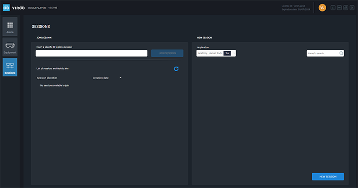
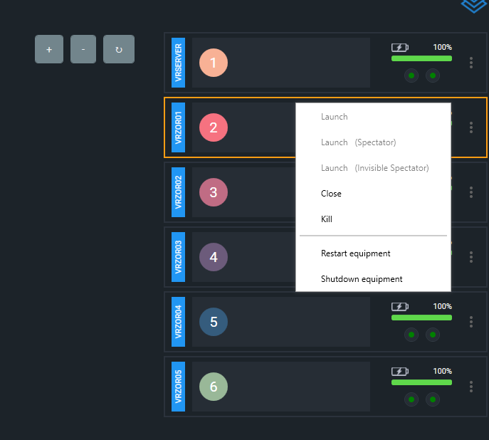
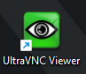
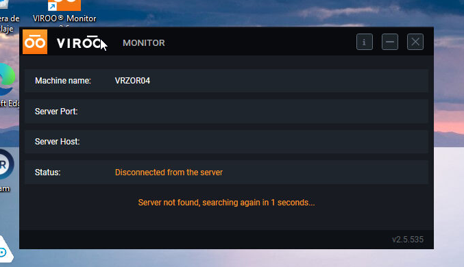

# 🇪🇸 🥽 VIROO Errealitate Birtualeko Aretoaren Erabilera Gidarekin

---

* [🇪🇸 VIROO Errealitate Birtualeko Aretoaren Erabilera Gida (Testu Laua)](https://www.google.com/search?q=%23-gu%C3%ADa-b%C3%A1sica-de-uso-de-la-sala-de-realidad-virtual-viroo-texto-plano)
    - [1. 🗓️ Aurreko Prestaketa eta Erreserba (Beharrezkoa)](https://www.google.com/search?q=%231-preparaci%C3%B3n-previa-y-reserva-paso-obligatorio)
    - [2. 🏗️ Aretoaren Prestaketa](https://www.google.com/search?q=%232-acondicionamiento-del-espacio)
    - [3. 🔌 Ekipoen Martxan Jartzea (VIROO)](https://www.google.com/search?q=%233-puesta-en-marcha-de-los-equipos-viroo)
    - [4. ▶️ VIROO Saioaren Hasiera](https://www.google.com/search?q=%234-inicio-de-la-sesi%C3%B3n-viroo)
    - [🏁 Amaiera (Itxiera)](https://www.google.com/search?q=%23finalizaci%C3%B3n-cierre)
    - [⚠️ Arazo Ezagunak](https://www.google.com/search?q=%23problemas-conocidos)

---

## 1. 🗓️ Aurreko Prestaketa eta Erreserba (Beharrezkoa)

* **✅ Eskuragarritasuna Baieztatu:**
  ⚠️ OBLIGAZIOZ, saioa antolatu aurretik ordutegia egiaztatu behar da.
  🔗 Ordutegia kontsultatu esteka honen bidez: [GLPI]()
  ℹ️ Laguntza behar izanez gero, ostiraletan, Mikel Dalmau 08:30etik 09:30era edo 10:30etik aurrera egon daiteke (aurrez abisatuta).

---

## 2. 🏗️ Aretoaren Prestaketa

* **1. Pausoa: 🧹 Joko Eremua Garbitzea:**
  Mugitu mahaiketa eta aulkiak aretoaren alboetara, espazio libre gehiago uzteko.

* **2. Pausoa: 💡 Argiztapena Doitzeko:**
  🕶️ Ziurtatu leihoak guztiz itxita daudela.
  🔆 Egiaztatu aretoko argia piztuta dagoela.

<image src="sala.jpg" alt="Sala Despejada" width="400"/>

## 3. 🔌 Ekipoen Martxan Jartzea (VIROO)

* **3. Pausoa: 🔓 Ekipoen Rack-a Irekitzea:**
  Ireki rack-a manillari desplazatuz. Ez da giltzarik behar.

* **4. Pausoa: 💻 Bisoreek (PC-ak) piztea:**
  🔢 Ekipo eta bisoreek 1etik 5era zenbakidunak dira.
  ⚡ Piztu bakarrik erabili nahi dituzun ekipoak, pizteko botoia sakatuz.

<image src="rack.jpg" alt="Sala Despejada" width="400"/>

* **5. Pausoa: 🖥️ Zerbitzaria piztu eta sartzea:**
  Piztu Zerbitzari Ekipoa.
  🔑 Sisteman sartu emandako kredentzialekin.

* **7. Pausoa: 🥽 VR Bisoreak Ireki eta Piztea:**
  🔑 Ireki bisoreen armairua. Giltza rack-aren goiko aldea dago.
  🔘 Piztu bisore bakoitza pizteko botoia sakatuz.

| Bisoreen Armairua                                                      |
| ---------------------------------------------------------------------- |
| <image src="armariovisores.jpg" alt="Armario de Visores" width="400"/> |

| Pizteko Botoia                                                          |
| ----------------------------------------------------------------------- |
| <image src="visor.jpg" alt="Botón de Encendido del Visor" width="400"/> |

## 4. ▶️ VIROO Saioaren Hasiera

* **8. Pausoa: 🖱️ VIROO Room Player Programaren irekiera:**
  Zerbitzarietan, bi aldiz klikatu VIROO Room Player programaren ikonoan. [Programaren ikonoaren argazkia]

* **9. Pausoa: 🆕 Saioa Sortu eta Aukeratzea:**
  Saioen fitxan, ezkerreko panelaren aldean ikusgai.
  📂 Aukeratu exekutatu nahi duzun programa edo esperientzia.

* **10. Pausoa: ➕ Bisoreak Saioari Atxikitzea:**
  Saioa sortu ondoren, piztu dituzun bisoreak saioari gehitu, "Launch" botoian sakatuz.
  

**👁️ Jarraipena eta Laguntza (VNC)**
Ikusi ikasle bakoitzak zer esperimentatzen duen, TeamViewer programa erabiliz zerbitzarian, ikusiko duzun ekipoa aukeratuz eta dagokion pasahitza erabiliz.

#### Dokumentazioa

* [Erabilera Gida (ES) - VIROO Room Player](VIROO® Room Player v2.6 - Guía de Uso %28ES%29.pdf)
* [VIROO Dokumentazioa, Room Player Interface](https://virooportal.virtualwareco.com/docs/2.6/viroo-players/room-player/interface/interface.html)

---

## 🏁 Amaiera (Itxiera)

1. **📴 Ekipoen Itxiera:** Itxi zerbitzaria eta bisoreen ekipo guztiak, pizteko botoia sakatuz mantenduz.

2. **🔋 Bisoreen Karga:** Gorde bisoreak armairuan eta utzi kargatzen.

3. **🔑 Giltzen eta Rack-en Kudeaketa:** Itxi bisoreen armairua, itzuli giltza rack-era eta itxi rack-a.

4. **🪑 Aretoaren Prestaketa:** Mahaiketa berriz jartzea hasierako kokapenan.

## ⚠️ Arazo Ezagunak

* **🎮 Manduen Karga:** Manduak ez dira kargatzen bisoreak piztu gabe. USB kargagailu kanpokoa erosi beharko da.

* **💥 Talka Arriskua:** Virtualeko aretoa fisikoan baino handiagoa da. Garrantzitsua da VIROO programan aretoaren tamaina aldatzea edo aretoa gelaren gisa uztea.

* **🖥️ Saioarekin Loturaren Arazoak:** Batzuetan, ekipuek ez dute saiora ondo konektatzen, garrantzitsua da VNC bidez egiaztatzea VIROO monitorra zerbitzarian dagoela, eta egiaztatzea exekutatzen den programaren bertsioa VIROO Room Player-arekin bat datorrela.

**📞 Kontaktua eta Laguntza**

👤 Mikel Dalmau
📧 [mdalmau@fpzornotzalh.eus](mailto:mdalmau@fpzornotzalh.eus)

🕒 Areto 3D Laguntza: Ostiraletan, aurrez abisatuta. 08:30-09:30 edo 10:30tik aurrera.
