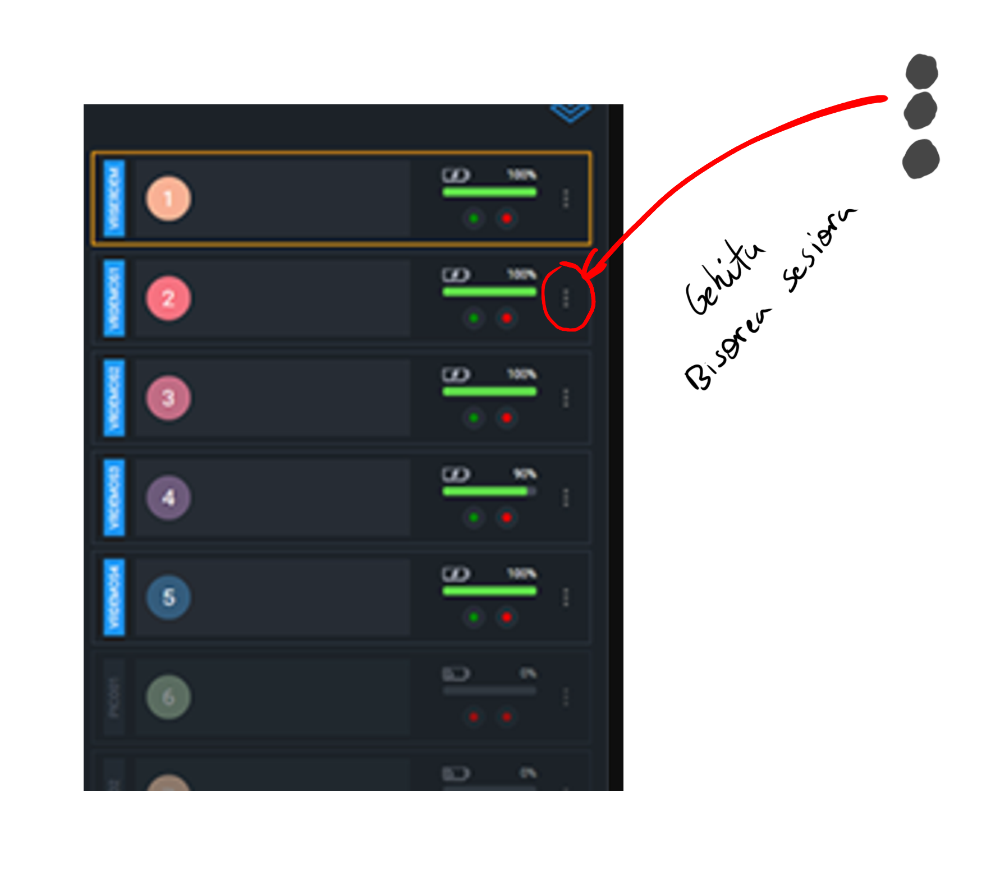

# 🇪🇺 🥽 VIROO Errealitate Birtualeko Gelaren Oinarrizko Gida (Testu Hutsa)

- [🇪🇺 🥽 VIROO Errealitate Birtualeko Gelaren Oinarrizko Gida (Testu Hutsa)](#--viroo-errealitate-birtualeko-gelaren-oinarrizko-gida-testu-hutsa)
  - [1. 🗓️ Aurretiazko Prestaketa eta Erreserba (Derrigorrezko Urratsa)](#1-️-aurretiazko-prestaketa-eta-erreserba-derrigorrezko-urratsa)
  - [2. 🏗️ Espazioa Egokitzea](#2-️-espazioa-egokitzea)
  - [3. 🔌 Ekipoak Martxan Jartzea (VIROO)](#3--ekipoak-martxan-jartzea-viroo)
  - [4. ▶️ VIROO Saioa Hastea](#4-️-viroo-saioa-hastea)
  - [🏁 Amaiera (Ixtea)](#-amaiera-ixtea)
  - [⚠️ Ezagunak diren Arazoak](#️-ezagunak-diren-arazoak)

-----

## 1. 🗓️ Aurretiazko Prestaketa eta Erreserba (Derrigorrezko Urratsa)

  **✅ Erabilgarritasuna Egiaztatzea:**
⚠️ DERRIGORREZKOA da ordutegia egiaztatzea saioa antolatu aurretik.
🔗 Kontsultatu ordutegia esteka honen bidez: [enlace al horario de la sala]
ℹ️ Ostiraletan laguntza behar baduzu, Mikel Dalmau 8:30etik 9:30era edo 10:30etik aurrera dago erabilgarri (aurrez abisatuta).

-----

## 2. 🏗️ Espazioa Egokitzea

- **1. Urratsa: 🧹 Joko Eremua Argi Uztea:**
Mugitu mahai eta aulki guztiak gelako alboetara. [Gelaren argazkia, mahaiak alboratuta]

- **2. Urratsa: 💡 Argiztapena doitzea:**
🕶️ Ziurtatu pertsianak erabat itxita daudela.
🔆 Egiaztatu gelako argia piztuta dagoela.

## 3. 🔌 Ekipoak Martxan Jartzea (VIROO)

- **3. Urratsa: 🔓 Ekipoen Rack-a Irekitzea:**
Ireki rack-a manilla irristatuz. Ez da beharrezkoa inolako giltzarik erabiltzea. [Rack-aren argazkia]

- **4. Urratsa: 💻 Bisoreen Ekipoak (PCak) Piztea:**
🔢 Ekipoak eta bisoreak 1etik 5era zenbakituta daude.
⚡ Piztu BAKARRIK erabiliko dituzun bisoreen ekipoak. [Ekipoen argazkia]

- **5. Urratsa: 🖥️ Zerbitzaria Piztu eta Sartzea:**
Piztu Zerbitzari Ekipoa.
🔑 Sartu sistema eragilean emandako kredentzialak erabiliz.

- **6. Urratsa: 🥽 Bisoreak Ireki eta Piztea:**
🔑 Ireki bisoreen armairua. Giltza rack-aren barruan dago. [Armairuaren eta giltzaren kokapenaren argazkia]
🔘 Piztu bisore bakoitza pizteko botoiari eutsiz. [Bisorearen pizteko botoiaren argazkia]

## 4. ▶️ VIROO Saioa Hastea

- **7. Urratsa: 🖱️ VIROO Room Player Programa Irekitzea:**
Zerbitzarian, egin klik bikoitza VIROO Room Player programaren ikonoan. 

- **8. Urratsa: 🆕 Saioa Sortu eta Hautatzea:**
Hautatu saio berri bat sortzeko aukera.
📂 Aukeratu exekutatu nahi duzun programa edo esperientzia. [Programaaren argazkia, hautaketa erakusten]

- **9. Urratsa: ➕ Bisoreak Saioari Gehitzea:**
Saioa sortu ondoren, gehitu piztu dituzun bisoreak saioari. [Aukera honen kokapenaren pantaila-argazkia programan]

- **10. Urratsa: 👁️ Jarraipena eta Laguntza (TeamViewer):**
Ikasle bakoitzak zer ikusten ari den ikusteko, erabili TeamViewer programa zerbitzarian, bistaratu nahi duzun ekipoa hautatuz eta dagokion pasahitza erabiliz.

## 🏁 Amaiera (Ixtea)
1. **📴 Ekipoak Itzaltzea:** Itzali lehenik bisoreak eta ondoren ekipoak, VIROO programan saioa itxi ondoren.

2. **🔋 Bisoreak Kargatzea:** Gorde bisoreak armairuan eta utzi korrontera konektatuta eta kargatzen.

3. **🔑 Giltzen eta Rack-aren Kudeaketa:** Itxi bisoreen armairua, itzuli giltza rack-era eta itxi rack-a.

4. **🪑 Gelaren Berregokitzapena:** Jarri mahaiak berriro jatorrizko posizioan.

## ⚠️ Ezagunak diren Arazoak
- **🎮 Mandoak Kargatzea:** Mandoak ez dira kargatzen bisorea piztuta ez badago. Kanpoko USB kargagailu bat eskuratu behar da.

- **💥 Talka egiteko Arriskua:** Eremu birtuala espazio fisikoa baino handiagoa da. Funtsezkoa da VIROO programan eremu birtualaren tamaina aldatzea edo gela klase gisa erabiltzeari uztea aztertzea.

**📞 Harremanetarako eta Laguntza**

👤 Mikel Dalmau
📧 mdalmau@fpzornotzalh.eus

🕒 3D gelako asistentzia: Ostiraletan, 8:30etik 9:30era edo 10:30etik aurrera (aurrez abisatuta).