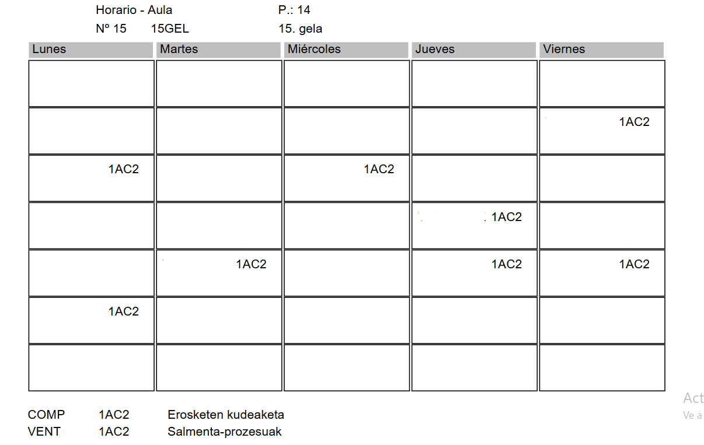

# Errealitate birtualeko gelaren gida

1. Bilera Maria Madarietarekin :white_check_mark:
2. Baimenen, aplikazioen kudeaketa eta erabiltzaileen sorrera VirooClouden :white_check_mark:
3. Unity instalazioa, Viroorako garapen-bertsioa :white_check_mark:
4. Adibide-proiektua instalatzea
5. Txemari idaztea FPCloud-eko txantiloiak sortzen laguntza eskatzeko :white_check_mark:
6. FPCloud-eko txantiloia amaitzea Viroo Single Player-rekin, erabiltzaile orokorrekin eta gidarekin.  :x:
7. 1AWA eta 1AWDko ikasleak errealitate birtualeko gelara eramatea esperimentatzera, urriaren azken astean eta azaroko lehen asteetan. :white_check_mark:
8. Ikasleek programa desberdinekin esperimentatuko dute, FPCloud-eko makinekin, Viroo Single Player eta Viroo Room Player-ekin, eta esperientziak dokumentatuko dituzte. :white_check_mark:
9. Erabilera-gida amaitzea ikasleekin egindako esperientziaren ondoren. :white_check_mark:
10. Gela erabili aurretik eta ondoren egiteko kontrol-zerrenda inprimatzea. (Gida inprimatuko da) :white_check_mark:

