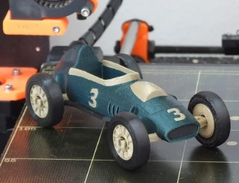

# Erakusketa-lagina: *Zilarrezko Geziak (Fórmula 1)*

## Formula 1 kotxe baten atzeko hegal konplexua eta bere osagai guztiak erakusteko eredua.

---

## 1. Arazoa eta Helburua
Helburua izan da **Fórmula 1 kotxe oso baten eredua inprimatzea**, honako hau erakusteko:
- **Kolore anitzeko inprimaketa** bi estrusore erabiliz (gorputza grisez eta gurpilen erdiguneak zuriz)
- **Diseinu aerodinamikoaren xehetasunak** (hegalak, grillak, kanpaingiroa)
- **Muntaketa mekanikoa** (ardatzak, gurpilak, eskapalak)

---

## 2. Pieza eta Diseinua
Aukeratutako eredua *Flechas Plateadas* F1 kotxearen osagairriak.

- *Tipologia:* Osagai Mekaniko / Maketa  
- *Eredua:* F1 Atzeko Hegala (Flechas Plateadas)  
- *Materiala:* PLA (Zuria + Grisa)  
- *Diseinu-iturburua:* [Thingiverse: 2421511](https://www.thingiverse.com/thing:2421511/files)  
- **Pieza Nagusiaren Tamaina (BODY):**
  - Zabalera (X): 3.52 cm
  - Luzera (Y): 12.59 cm
  - Altuera (Z): 3.01 cm
- **Gurpilaren Tamaina (WHEEL TIRE):**
  - Zabalera: 3.44 cm
  - Luzera: 3.44 cm
  - Altuera: 0.85 cm

---

## 3. Inprimaketa Parametroak
| Parametroa | Balioa |
|-------------|--------|
| Geruza altuera | 0.8 mm |
| Hormak / Pareta-kopurua | 3 |
| Betetze portzentaia eta patroia | 15% (Giroid pattern) |
| Inprimaketa-abiadura | 60 mm/s |
| Euste-egitura (supports) | Bai |
| Inprimaketa-denbora | 5 ordu 57 minutu |
| Material Erabilita | 54g (PLA Zuria + PLA Grisa) |
| Extrusore Kopurua | 2 (Kolore bikoitzeko inprimaketa) |
| Inprimaketa softwarea | Ultimaker Cura 5.8 |

---

## 4. Piezen Zerrenda
- Wheel_center.stl
- Wheel_center.stl (1)
- Wheel_center.stl (2)
- Wheel_center.stl (3)
- Wheel_tire.stl
- Wheel_tire.stl (1)
- Wheel_tire.stl (2)
- Wheel_tire.stl (3)
- No1_Body.stl
- No1_Numbers.stl
- Plexi.stl
- Grill.stl
- Axles.stl
- Cover.stl
- Exhausts.stl

---

## 5. Loturak
- [Jatorrizko proiektua Thingiverse-en](https://www.thingiverse.com/thing:2421511/files)

---

*Egilea:* Aida Iñan Prieto  
*Erronka:* 1 · 3D Inprimaketa — Gidak eta Tipologien Erakusketa  
*Taldea:* (Zure taldearen izena hemen)  
*Urtea:* 2025