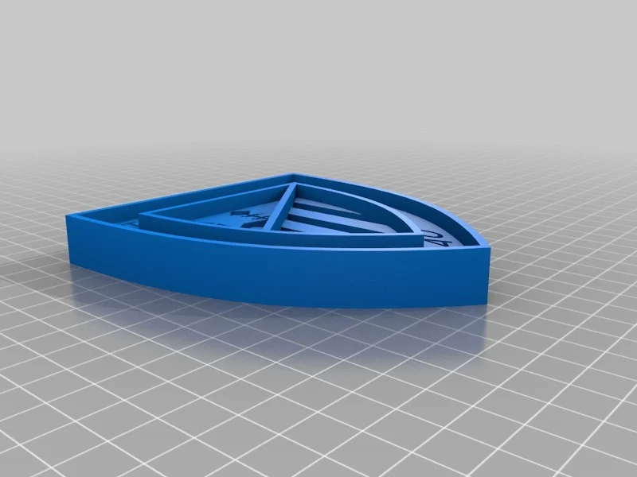
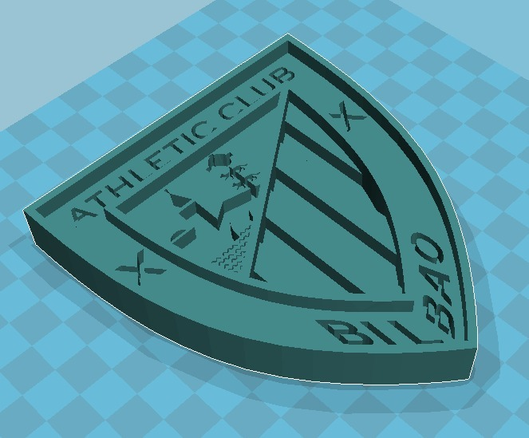

# Athletic Club Bilbao

Parametro,Valor,Razón Didáctica
-
Impresora,[Athletic_club_bilbao],
Dimensión,Medida Seleccionada,Justificación
Ancho (Eje X),100 mm,Tamaño mediano ideal para una exposición A4.

Alto (Eje Y),103 mm (Aproximado),
-
"Proporcional al ancho, manteniendo la forma del escudo."
Espesor Total (Eje Z),8 mm,"Grosor suficiente para ser robusto y fácil de manejar, pero rápido de imprimir."
Altura del Relieve,2 mm,Diferencia de altura visible entre la base y las letras/símbolos.

Parámetro,Valor Específico,Demostración de Textura/Relieve
-

Orientación (α),Plana sobre la base (Cara del escudo mirando al cielo).,Asegura que el top surface (donde están los relieves) sea de máxima calidad y que las líneas de capa sean visibles en los laterales curvos.
Altura de Capa (h),Base: 0.2 mm / 
Superficie superior: 0.1 mm,"Se utiliza Altura de Capa Variable o se fuerza el 0.1 mm en las últimas capas. 
Esto hace que las letras y símbolos se vean nítidos y suaves, contrastando con la aspereza del lateral (0.2 mm)."
Material,"PLA (Rojo o Blanco, color del club)",Fácil de imprimir y acabado visual limpio.
Soportes,No necesarios,El ángulo de los contornos es manejable para voladizos leves; la impresión plana no requiere soporte.