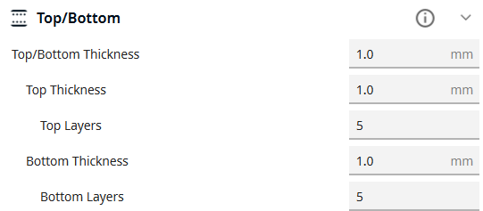
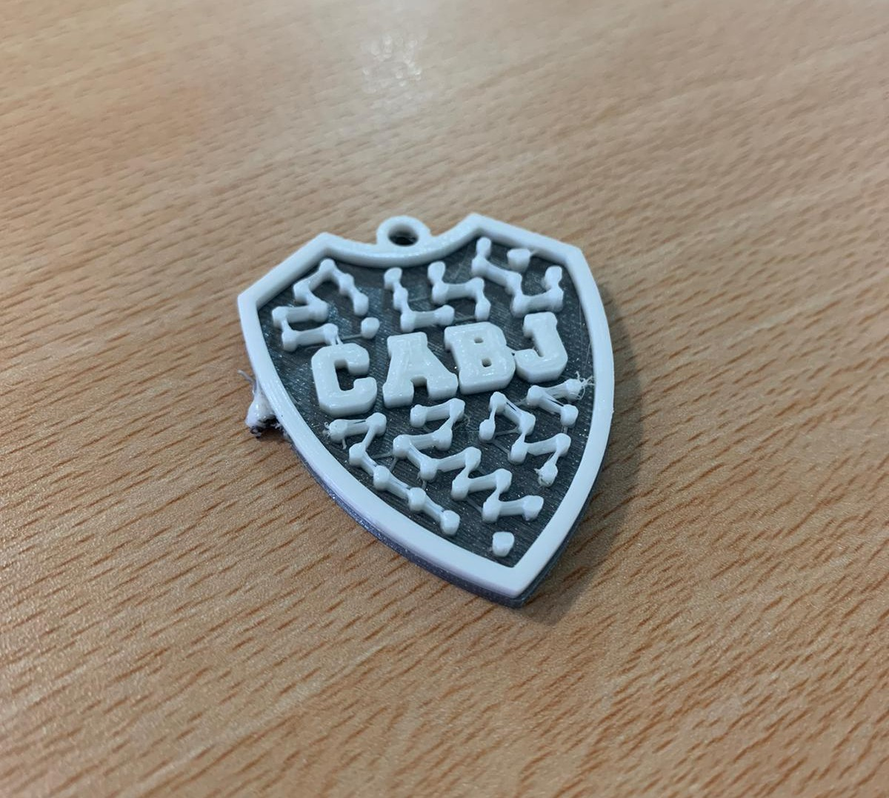

# Llaveros
---
**_BOCA JUNIORS_**

[Archivo STL del Llavero](Llavero_Boca_Juniors/UMS3_Llavero_BocaJuniors.stl)

Elegí esta pieza por varias razones:
- Boca es el mas grande.
- Elegí un llavero para darle utilidad en el día a día.
- Al ser una pieza pequeña, no lleva mucho tiempo de creación ni tanto gasto de material.
---
#### PARÁMETROS
En los dos extrusores el material usado es **PLA**, y el **print core** es AA 0.4.

Para usar dos colores en la pieza, utilice un separarador con estos parámetros:
- **x**: -0.1273mm
- **y**: -0.4638mm
- **z**: 2mm
---
### Procesos
_14/10/2025_
Primer intento de creación fallido, al hacer la impresión tuve errores que no me permitieron finalizarla.

_21/10/2025_
Segundo intento realizado con éxito, esta vez pude solucionar el error y pude crear la pieza.
Hubo cambios de colores:
