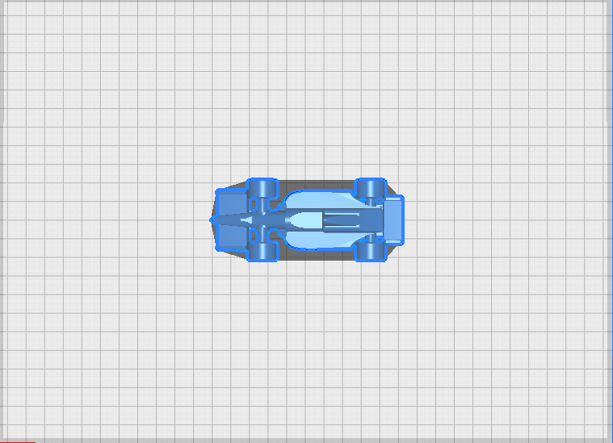
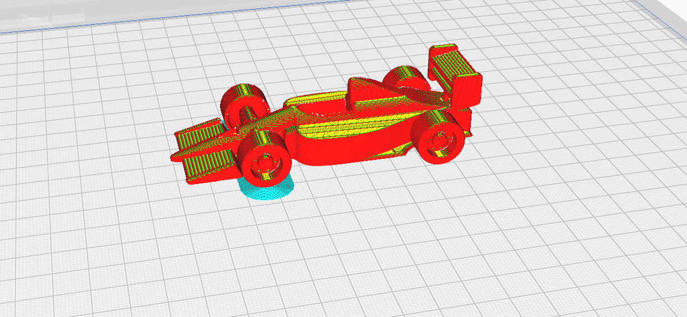

# F1 Car - 364951

## 📄 Descripción
Este es un modelo 3D de un coche de F1, 
una flor venerada en diversas religiones y que crece sobre nenúfares. Nuestro propósito inicial fue crear una figura decorativa que integre una perspectiva natural y única.

### 💡 Un poco de contexto...
El modelo fue subido originalmente a Thingiverse por el usuario *Digi-Kitsamus*. 
Aunque podría haber sido diseñado como un soporte para móviles, hemos decidido presentarlo como una simple figura decorativa con una temática natural.

## 📥 Archivos del modelo
*   **[Archivo STL](F1-v1.stl)**
*   **[Archivo 3MF](UMS5_F1_v1.3mf)**

## 📷 Previsualización del modelo

## ⚙️ Detalles de impresión

Dimensiones	76.5 x 76.5 x 49.4 mm
Tiempo estimado	2 horas 4 minutos
Material necesario	37g (4.69 m)

  