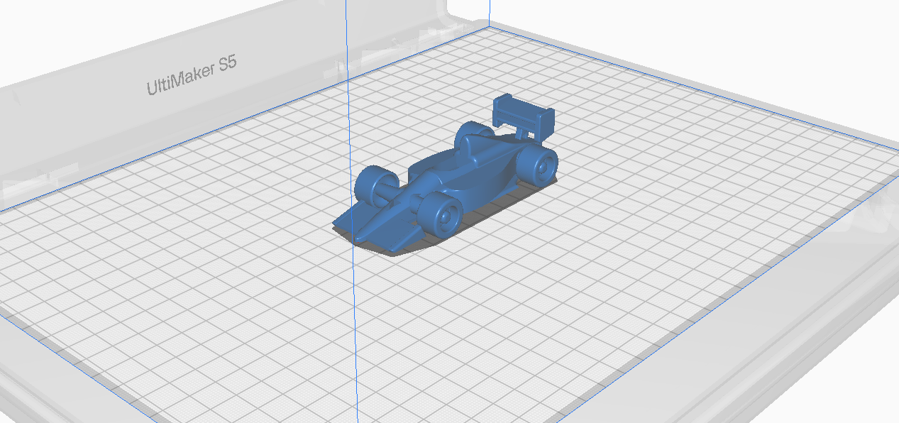

# Catalogo

> Repositorio con modelos 3D para impresión y ejemplos de buenas prácticas.

| Modelo | Miniatura |
|--------|-------------|
| [Aston Martin Giltzarria](<benat/Aston_Martin.pdf>) | </a> |
| [Flor de loto](<Gaizka_David_FlorDeLoto/FlorDeLoto.md>) | </a> |
| [Pez articulado](<Aitor_Mikel/Digi 25-26 3D.md>) | </a> |
| [Cadena malla](<cadena/cadena.md>) | </a> |
| [Suzuki](<Fernando_Yassine/Suzuki PV50 kitcard.md>) | </a> |
| [Aguijon](<HK-Daymer/Hollow Knigth Print 3D.md>) | </a> |
| [Martillo de Thor](<Martillo_Urtzi_Jon/Martillo.md>) | </a> |
| [Delivery Moto](<UnaxJonathan/README.md>) | </a> |
| [Lagarto Articulado](<sare_flex_YerayGarrido/sare_flex.md>) | </a> |
| [Moai](<Ivan-Octa/Read.md>) | </a> |
| [Sinji](<Dani_Iker/index.md>) | </a> |
| [Mamua](<Jon Ander/Mamua.md>) | </a> |
| [Caza](<caza/dokumentazioa>) | </a> |
| [LOTR Anillo](<Egoitz/Kaixo.md>) | </a> |
| [F1](<Maider/F1.md>) | </a> |